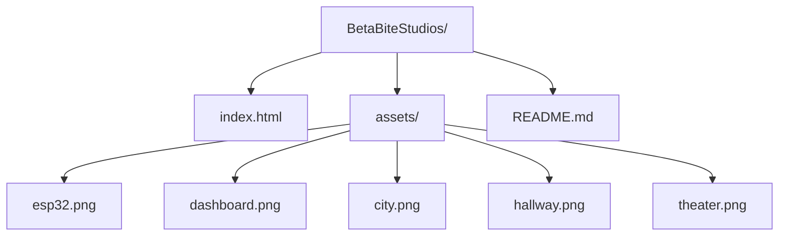

<div align="center">
  
  # ✦ BETA BITE STUDIOS ✦
  
  ### *Where Code Meets Cosmos*
  
  [](https://betabite-studios.vercel.app)
  [](https://github.com/PhantomXReborn)
  [](LICENSE)
  [](https://github.com/PhantomXReborn)
  
  > *"Crafting digital experiences across the multiverse of game development, simulation, and full-stack engineering."*

</div>

---

## 🌠 **The Vision**

Welcome to the **BetaBite Studios** portfolio universe — a digital nebula where code particles dance across the void, and innovation knows no bounds. This isn't just a website; it's an immersive journey through our creative cosmos, featuring:

<div align="center">
  
  | 🎮 **Game Worlds** | ⚙️ **Simulation Realms** | 🌐 **Digital Ecosystems** | 🔌 **Hardware Frontiers** |
  |:---:|:---:|:---:|:---:|
  | Roblox • Godot • Unreal | C++ • Python • Java | React • Node.js • PostgreSQL | ESP32 • Arduino • IoT |

</div>

---

## ✨ **Celestial Features**

<div align="center">
  
  | 🌌 **Galactic Canvas** | 🎠 **Project Carousel** | 📡 **Live GitHub Feed** |
  |:---:|:---:|:---:|
  | Animated particles, stars & code glyphs | Interactive slider with tech overlays | Real-time repository showcase |
  
  | 🔮 **Theme Shapeshifter** | 📊 **Scroll Alchemy** | ✨ **Responsive Magic** |
  |:---:|:---:|:---:|
  | Dark/Light mode with ⌨️ 't' shortcut | Animated counters & progress bar | Seamless across all dimensions |

</div>

### 🎯 **Keyboard Wizardry**
- Press `t` to toggle between dimensions (dark/light)
- Scroll to witness statistical alchemy
- Hover to reveal hidden code overlays

---

## 🛸 **Tech Constellation**

<div align="center">
  
  ### Frontend Galaxy
  
  
  
  
  ### Visual Nebula
  
  
  
  
  ### Integration Universe
  
  
</div>

---

## 🗂️ **Cosmic Structure**


🔮 Arcane Code Snippets
✨ Theme Transmutation
```javascript
document.addEventListener('keydown', (e) => {
  if (e.key === 't' && !e.ctrlKey && !e.metaKey) {
    toggleBtn.click(); // The 't' key whispers to the cosmos
  }
});
```
📊 Number Alchemy
```javascript
const counterObserver = new IntersectionObserver((entries) => {
  entries.forEach(entry => {
    if (entry.isIntersecting) {
      animateCounter(entry.target); // Numbers ascend from the void
    }
  });
}, { threshold: 0.5 });
```
🌌 Stellar Particle System
✦ 420+ stars wandering the digital expanse

✦ 150+ floating code runes with sentient motion

✦ Mouse trails leaving behind glyphic whispers

🚀 Deploy to the Stars
Option 1: ✨ Vercel (Recommended)
```bash
# Summon the Vercel CLI
npm i -g vercel

# Launch to orbit
vercel --prod
```
Option 2: 🌐 Netlify
Drag your cosmic index.html into the Netlify portal

Option 3: 🪐 GitHub Pages
Push to <username>.github.io

Activate pages in the repository's mystical settings

🎨 Customize Your Cosmos
Add/Remove Stellar Slides
```html
<div class="slider-card">
  
  <div class="slider-content-overlay">
    <h3>✨ Project Title</h3>
    <p>Your cosmic creation</p>
    <div class="tech-tags">
      <span>🌟 Tag1</span>
      <span>⚡ Tag2</span>
    </div>
  </div>
</div>
Change the Celestial Watcher
javascript
const username = 'YourGitHubUsername'; // Summon your own repositories
Recode the Color Universe
css
:root {
  --accent-blue: #1a3a5c;     /* Deep space */
  --accent-blue-light: #2b5a8a; /* Stellar glow */
  /* ... Let your imagination drift among the stars */
}
```
📜 License of the Ancients
This project is blessed under the MIT License — a sacred text that allows you to forge, enhance, and share your own cosmic creations. See the LICENSE file for the full incantation.

🤝 Join the Cosmic Order
Contributions from fellow cosmic travelers are welcomed with open arms!

🌌 Fork the repository

✨ Create a feature branch (git checkout -b feature/cosmic-idea)

🚀 Commit your changes (git commit -m 'Add cosmic idea')

🌠 Push to the branch (git push origin feature/cosmic-idea)

🌟 Open a Pull Request to the universe

📡 Interstellar Communication
<div align="center">
BetaBite Studios

https://img.shields.io/badge/%F0%9F%8C%8C_PhantomXReborn-181717?style=flat-square&logo=github&logoColor=white
https://img.shields.io/badge/%F0%9F%93%A7_betabite.studios@email.com-D14836?style=flat-square&logo=gmail&logoColor=white

</div>
<div align="center"> <br>
✦ Crafted with <code></></code> and cosmic energy by BetaBite Studios ✦

<sub>© 2024 BetaBite Studios • All rights reserved across all dimensions</sub>

</div> ```
